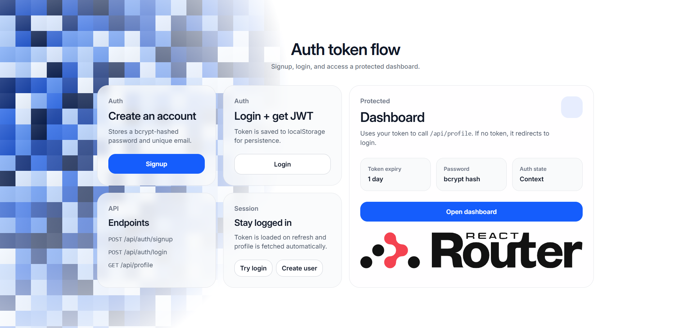
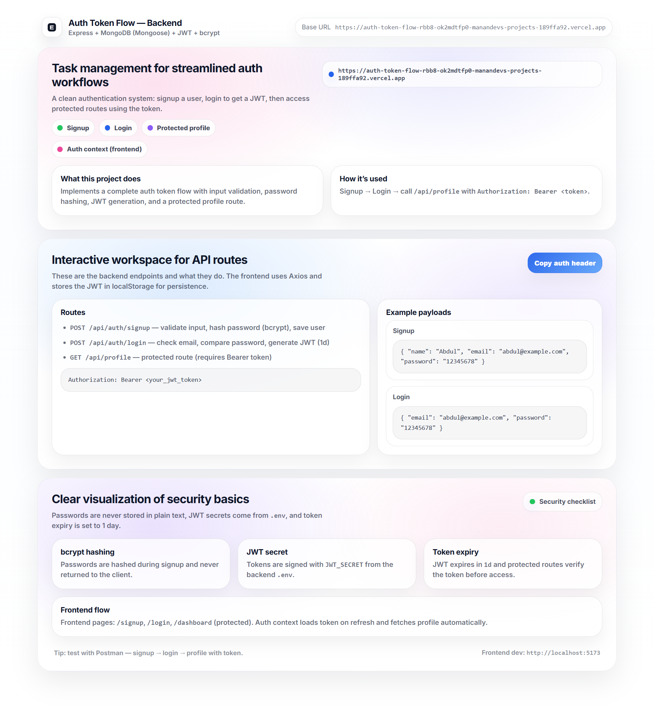

# Auth Token Flow



> **Secure, modern full-stack JWT authentication starter.**  
> Build and ship production-style auth flows fast: Signup, Login, Protected Routes, Persistent Sessions, and polished UI.

<div align="center">

  
  
  
  
  

</div>

## About The Project

`Auth Token Flow` is a complete reference implementation for authentication systems in modern web apps.  
It includes a secure Express API and a React Router frontend with clean UX, route protection, and session persistence.

Perfect for:
- learning auth architecture end-to-end
- bootstrapping SaaS/app starters
- interview-ready project demos

## Key Features

<table>
  <tr>
    <td align="center" width="33%">
      <h3>Secure Auth APIs</h3>
      <p>Signup/Login endpoints with validation, duplicate checks, bcrypt hashing, and JWT generation.</p>
    </td>
    <td align="center" width="33%">
      <h3>Protected Routes</h3>
      <p>Backend middleware verifies Bearer token and blocks unauthorized profile access.</p>
    </td>
    <td align="center" width="33%">
      <h3>Modern Frontend UX</h3>
      <p>Styled Home/Login/Signup/Dashboard pages with Auth Context, loading states, and clear errors.</p>
    </td>
  </tr>
</table>

## Stats & Capabilities

| Capability | Details |
| :--- | :--- |
| **Password Security** | `bcrypt` hashing only, never plain text storage |
| **Token Auth** | JWT with `expiresIn: 1d` |
| **Session Persistence** | Token stored in `localStorage`, restored by Auth Context |
| **Protected API** | `GET /api/profile` requires `Authorization: Bearer <token>` |
| **Error Handling** | Duplicate email, invalid credentials, missing token all handled cleanly |

## How It Works

Four simple steps from account creation to protected access:

1. **Signup** — user submits `name`, `email`, `password`
2. **Login** — backend validates credentials and returns JWT
3. **Persist Session** — frontend stores token and restores auth state on reload
4. **Access Protected Data** — dashboard fetches `/api/profile` with Bearer token

## Project Structure

```text
auth-token-flow/
├─ backend/
│  ├─ config/db.js
│  ├─ middleware/authMiddleware.js
│  ├─ models/User.js
│  ├─ public/index.html
│  ├─ routes/authRoutes.js
│  ├─ routes/profileRoutes.js
│  └─ server.js
├─ frontend/
│  ├─ app/context/AuthContext.tsx
│  ├─ app/lib/api.ts
│  ├─ app/lib/http.ts
│  ├─ app/lib/token.ts
│  ├─ app/routes/
│  │  ├─ home.tsx
│  │  ├─ login.tsx
│  │  ├─ signup.tsx
│  │  └─ dashboard.tsx
│  └─ app/routes.ts
└─ public/images/
   ├─ backend.png
   └─ fronted.png
```

## Tech Stack

<div align="center">

  
  
  
  
  
  

</div>

## Environment Variables

### `backend/.env`

```env
PORT=3000
MONGODB_URI=your_mongodb_connection_string
JWT_SECRET=your_super_secret_key
```

### `frontend/.env`

```env
VITE_API_URL=http://localhost:3000/api/auth
```

## Getting Started

### Prerequisites
- Node.js `18+`
- npm
- MongoDB Atlas (or local MongoDB)

### Backend Setup

```bash
cd backend
npm install
npm run dev
```

Backend runs at: `http://localhost:3000`

### Frontend Setup

```bash
cd frontend
npm install
npm run dev
```

Frontend runs at: `http://localhost:5173`

## API Endpoints

### `POST /api/auth/signup`
- Validates `name`, `email`, `password`
- Normalizes email
- Checks duplicate users
- Hashes password and creates account

### `POST /api/auth/login`
- Verifies email/password
- Returns JWT (`expiresIn: 1d`)

### `GET /api/profile` (Protected)
- Requires `Authorization: Bearer <token>`
- Verifies JWT via middleware
- Returns authenticated user profile

## Security Notes

- Passwords are never stored in plain text
- JWT secret is loaded from `.env`
- Token expiry enabled (`1d`)
- Protected route blocks unauthenticated requests
- Login errors are generic to avoid user enumeration

## Testing Checklist

- [ ] Signup success
- [ ] Duplicate email returns error
- [ ] Login success
- [ ] Wrong password returns error
- [ ] Protected route works with token
- [ ] Protected route fails without token

## Screenshots

### Frontend


### Backend Landing Page


---

<div align="center">
  Built with ❤️ for clean, secure authentication workflows.
</div>

